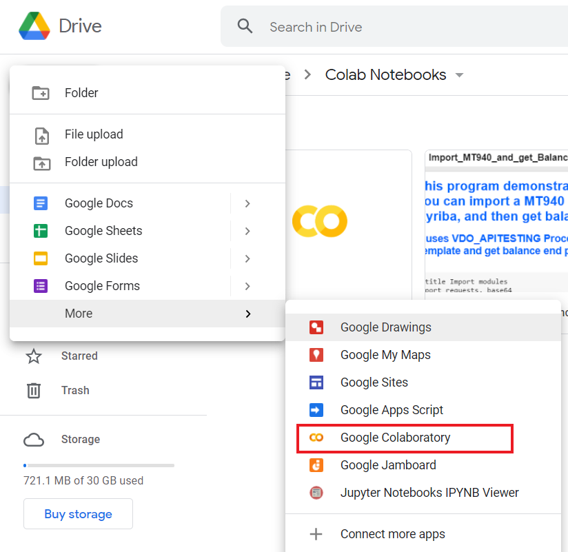
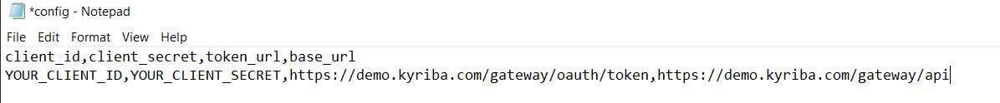
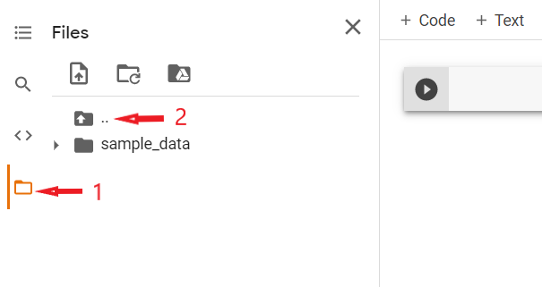
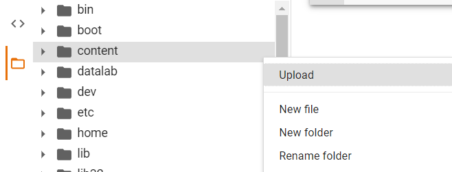
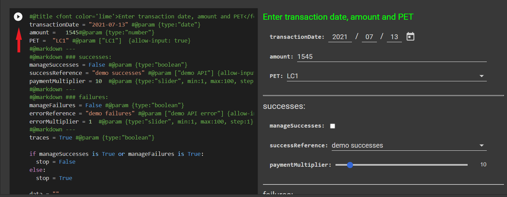

# DEMO_transfers


## Requirements

Opening .ipynb files requires:
1. Google Colaboratory [Installation][1]

[1]: https://workspace.google.com/marketplace/app/colaboratory/1014160490159?pann=ogb


## Installation

To copy file to your computer copy link of the repository, open Command Prompt, go to the location where file will be copied and execute git clone command:

```shell
git clone https://github.com/OlhaLevko/DEMO_transfers_kyriba.git
```

In your Google Drive chose to create new file in the list of formats go to more and then chose Google Colaboratory: 




Then follow next steps: File -> Upload notebook -> Upload -> Chose file. And select DEMO_transfers.ipynb from your device.

To run application you also need to have config.csv file with your client credential. Config file should look like this:



Upload this file in the content folder:





Then you can run all application: 


or execute separated ceil:



Results you can see under the ceil.

> ⚠️  _Please notice that Python is script language and code will be executed row by row or in the order you will run the cells._
